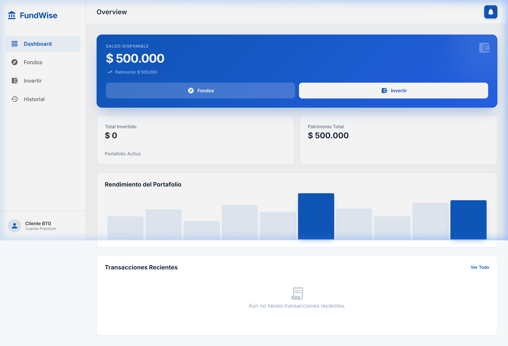
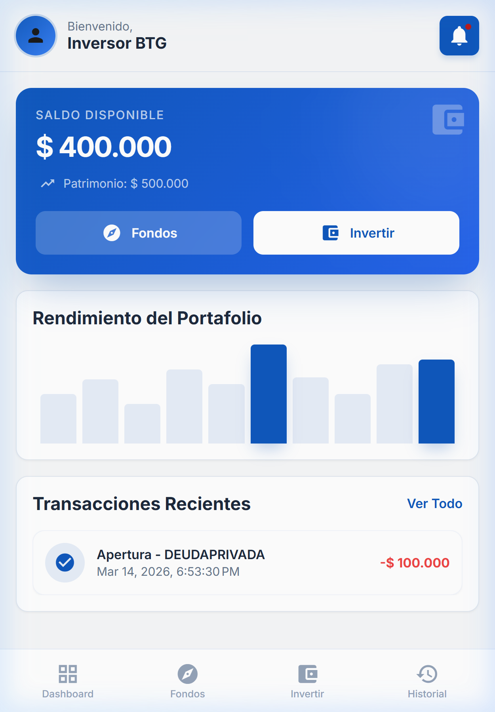
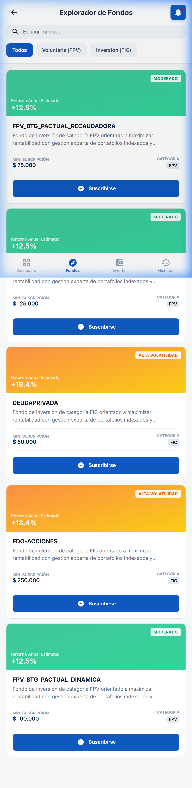

# 🏦 FundWise - BTG Funds Management

<p align="center">
  
  
  
  
  
</p>

---

**FundWise** es una plataforma premium de gestión de fondos de inversión diseñada específicamente para clientes de BTG Pactual. Ofrece una experiencia fluida, visualmente impactante y completamente responsiva para administrar suscripciones a fondos FPV y FIC con total seguridad y transparencia.

## ✨ Características Destacadas

- 💎 **Diseño Premium**: Interfaz moderna con efectos de glassmorphism, gradientes suaves y micro-animaciones.
- 📱 **Totalmente Responsivo**: Experiencia optimizada para Desktop, Tablet y Mobile con navegación adaptativa.
- 📊 **Reportes Profesionales**: Motor de exportación mejorado a **PDF** y **Excel** capaz de procesar grandes volúmenes de datos.
- 🔔 **Centro de Notificaciones**: Panel interactivo para el seguimiento de operaciones en tiempo real.
- 🛡️ **Validaciones Blindadas**: Control estricto de montos mínimos de suscripción y saldo disponible.
- ⚡ **Arquitectura Moderna**: Standalone components, Routing Lazy Loading y manejo de estado con **Signals**.

---

## 📸 Vista Previa

### Dashboard & Analytics (Desktop)


### Experiencia Mobile
<p align="center">
  
  
</p>

---

## 🛠️ Stack Tecnológico

- **Frontend**: Angular 21 (Standalone Architecture)
- **Lenguaje**: TypeScript 5.9
- **Estilos**: Vanilla SCSS con sistema de variables centralizado.
- **Librerías UI**: Angular Material (Icons, Dialogs, Tables).
- **Manejo de Estado**: Reactive Forms, Signals, y RxJS.
- **Mock API**: JSON Server.

---

## 🚀 Instalación y Ejecución

Siga estos pasos para desplegar el proyecto localmente:

### 1. Clonar el repositorio
```bash
git clone https://github.com/tony0217/prueba-tecnica-front-BTG.git
cd prueba-tecnica-front-BTG
```

### 2. Instalar dependencias
```bash
npm install
```

### 3. Iniciar el Ecosistema
Ejecute ambos comandos en terminales separadas:

**Terminal A (API REST):**
```bash
npm run server
```

**Terminal B (Angular Dev Server):**
```bash
npm start
```

La aplicación abrirá automáticamente en `http://localhost:4200/`.

---

## 🏗️ Estructura del Proyecto

```
src/app/
├── core/       # Singleton services, modelos de datos e interceptores funcionales.
├── features/   # Módulos de negocio: Dashboard, Explorador de Fondos, Portafolio e Historial.
├── shared/     # Componentes presentacionales, Pipes de formato y utilidades comunes.
└── assets/     # Recursos estáticos: iconos BTG, imágenes y estilos base.
```

---

## 🧪 Pruebas Unitarias

Se cuenta con una cobertura exhaustiva para garantizar la estabilidad del sistema:

```bash
npm test
```

---

## 📄 Documentación Adicional
Para más detalles sobre el uso paso a paso de todas las funcionalidades, consulte:
- [📖 Manual de Usuario (Markdown)](./manual-usuario.md)
- [📥 Manual de Usuario (PDF)](./manual-usuario.pdf)

---

## 👤 Autor
**Anthony Henríquez Casallas**
- [GitHub](https://github.com/tony0217)
- [LinkedIn](https://www.linkedin.com/in/anthony-henriquez-casallas/)

---
<p align="center">Proyecto desarrollado para el proceso de selección técnica de BTG Pactual.</p>
