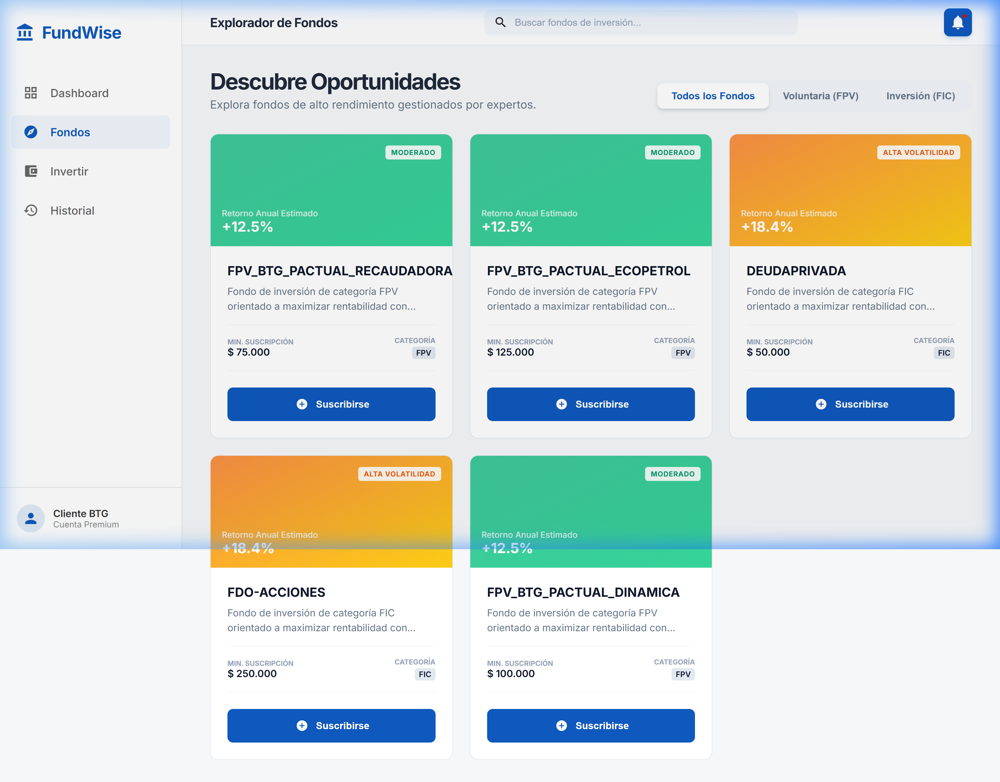
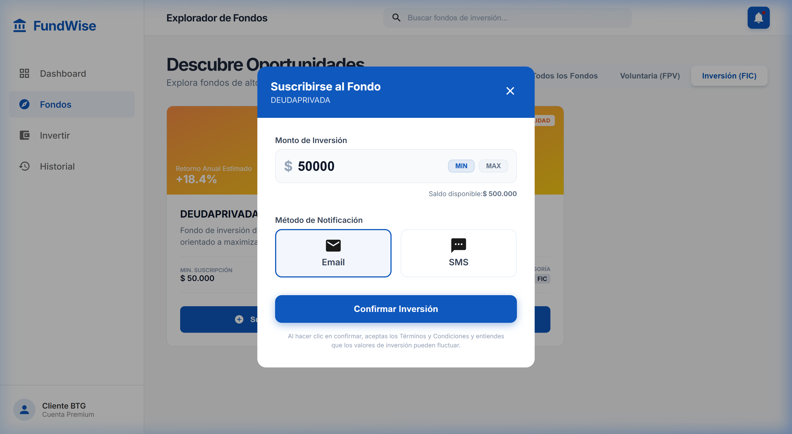
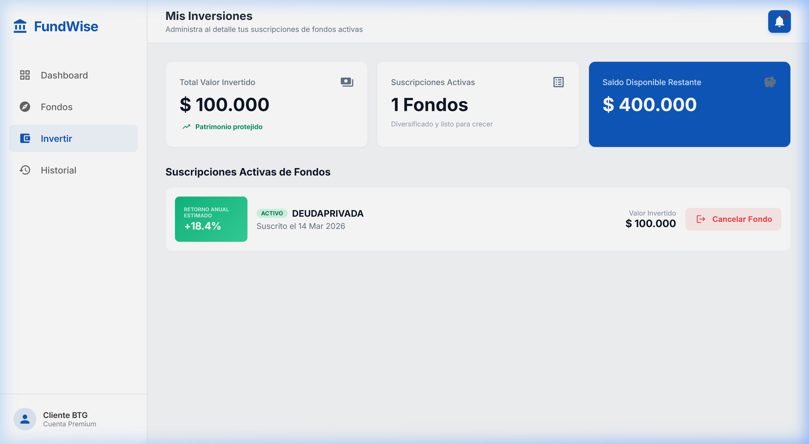
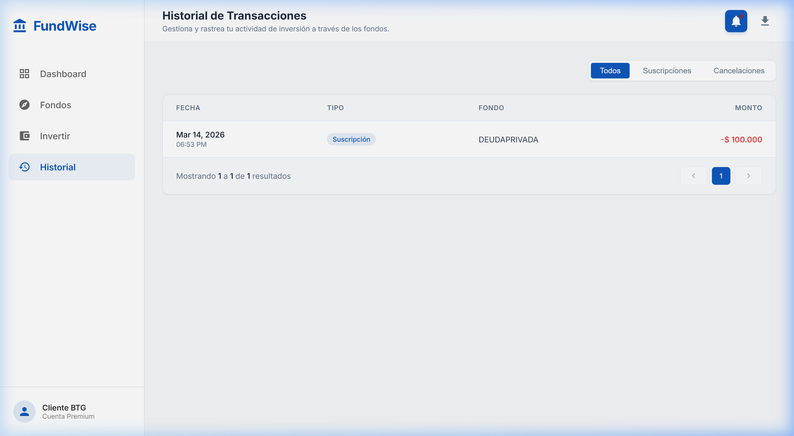
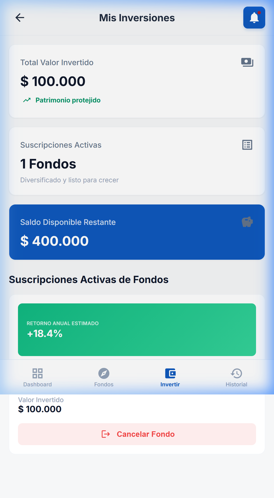
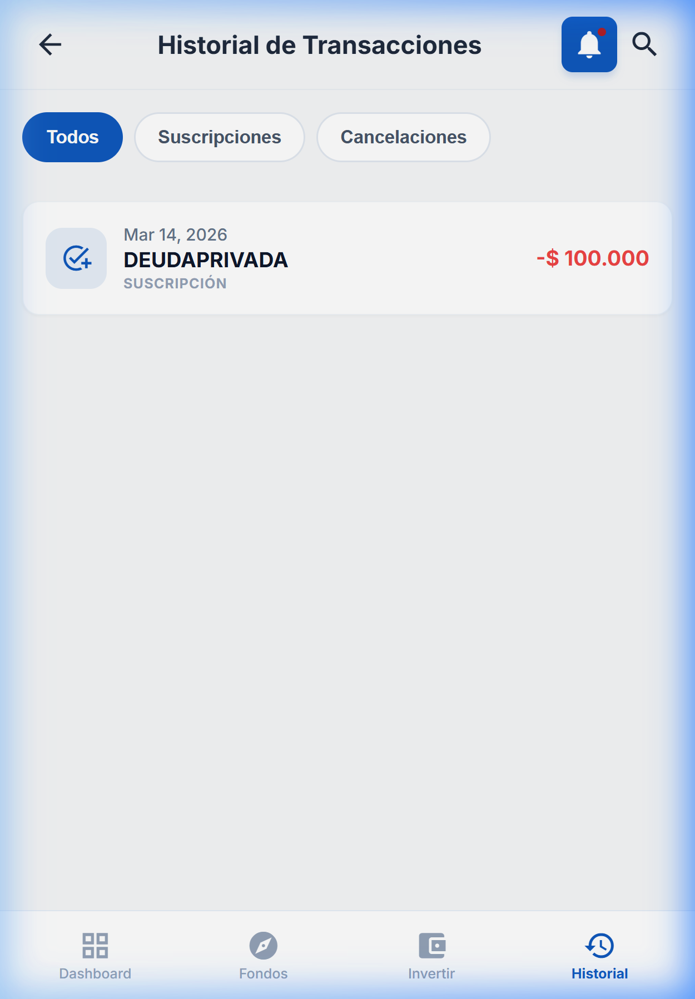
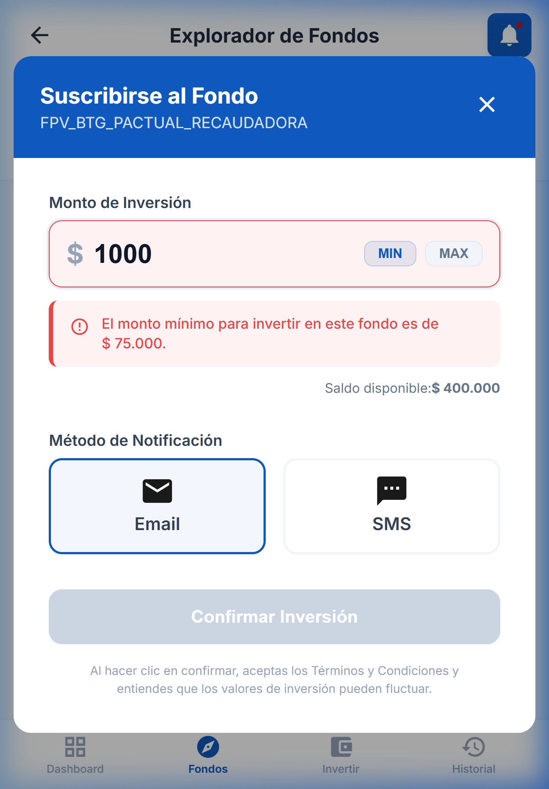
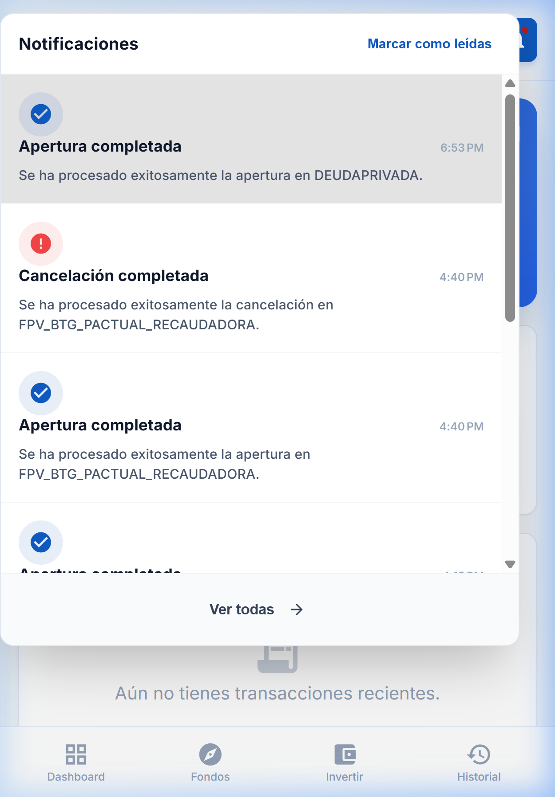

# Manual de Usuario - BTG Funds Management

Bienvenido a la guía oficial de **FundWise**, la plataforma líder para la gestión de fondos de inversión (FPV y FIC) de BTG Pactual. Este documento detalla cómo iniciar el proyecto, navegar por sus funcionalidades y aprovechar al máximo la experiencia tanto en escritorio como en dispositivos móviles.

---

## 🚀 Guía de Inicio Rápido

Para poner en funcionamiento el ecosistema de **FundWise**, siga estos pasos:

### 1. Requisitos Previos
- Node.js (v18 o superior)
- Angular CLI
- Git

### 2. Instalación y Ejecución
Ejecute los siguientes comandos en terminales separadas:

**Backend (Mock API):**
```bash
npm run server
```
*Se levantará en `http://localhost:3000`*

**Frontend (Angular):**
```bash
npm start
```
*La aplicación estará disponible en `http://localhost:4200`*

---

## 🖥️ Experiencia Desktop

La vista de escritorio ofrece una experiencia completa con una barra lateral de navegación persistente y visualizaciones amplias.

### 📊 Dashboard (Resumen General)
Es el centro de control donde podrá ver su **Saldo Disponible**, el **Patrimonio Total** y el rendimiento acumulado.


*Pantalla principal con resumen de saldos y gráfico de rendimiento.*

### 🧭 Explorador de Fondos
En esta sección podrá descubrir nuevas oportunidades de inversión.
- **Filtros Inteligentes**: Filtre por **Todos**, **FPV** o **FIC**.
- **Tarjetas Informativas**: Cada fondo muestra su nombre, descripción, retorno anual estimado y monto mínimo de suscripción.



### ✍️ Proceso de Suscripción
Al hacer clic en "Suscribirse", se abrirá un asistente interactivo:
1. **Monto**: Ingrese el valor a invertir (debe cumplir con el mínimo del fondo).
2. **Notificación**: Elija recibir su confirmación por **Email** o **SMS**.



### 💼 Mis Inversiones
Gestione sus fondos activos. Aquí podrá ver el desglose de su portafolio y realizar cancelaciones de suscripciones si lo desea.



### 📜 Historial de Transacciones
Un registro detallado de todos sus movimientos.
- **Búsqueda y Filtros**: Encuentre transacciones por tipo o fondo.
- **Exportación**: Descargue sus datos en formatos **PDF** o **Excel** profesional.



---

## 📱 Experiencia Mobile

La aplicación se adapta automáticamente a dispositivos móviles para que pueda gestionar sus finanzas desde cualquier lugar.

### Dashboard Móvil


### Explorador de Fondos Móvil


### Inversiones y Actividad Móvil


### Historial de Transacciones Móvil


---

## 🛡️ Seguridad y Validaciones

La plataforma cuenta con un robusto sistema de reglas para proteger sus inversiones y asegurar la integridad de los datos.

### 1. Validación de Monto Mínimo
Cada fondo tiene un requisito de inversión inicial. Si intenta ingresar un monto menor, el sistema bloqueará la operación y mostrará una alerta clara.


*Ejemplo de validación al intentar invertir menos del monto mínimo permitido.*

### 2. Control de Saldo Disponible
No es posible suscribirse a un fondo si el monto excede su **Saldo Disponible**. El botón de suscripción final se deshabilitará o mostrará un error si los fondos son insuficientes.

---

## 🔔 Centro de Notificaciones

Ubicado en la parte superior derecha (icono de campana), este centro registra todos sus eventos importantes en tiempo real:
- Confirmaciones de suscripción exitosa.
- Notificaciones de cancelación de fondos.
- Alertas de sistema.


*Vista detallada de las notificaciones recientes con opciones para marcar como leídas.*

---

## 📄 Notas Adicionales
- **Ambiente**: Los datos mostrados corresponden al ambiente de pruebas (Mock API).
- **Exportación masiva**: La exportación a Excel en el Historial procesa la totalidad de sus registros, independientemente de la página que esté visualizando en la tabla.
- **Soporte**: Las notificaciones por Email y SMS son simulaciones visuales para demostrar el flujo de comunicación multicanal.
